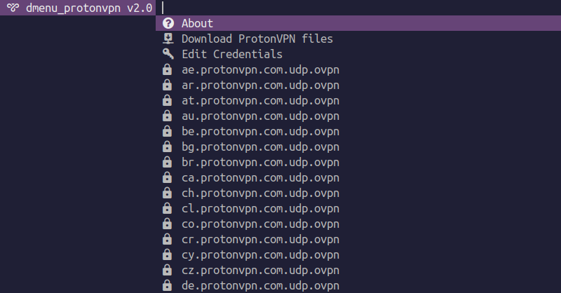
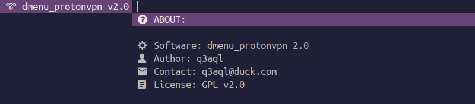
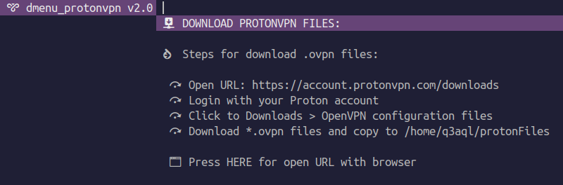
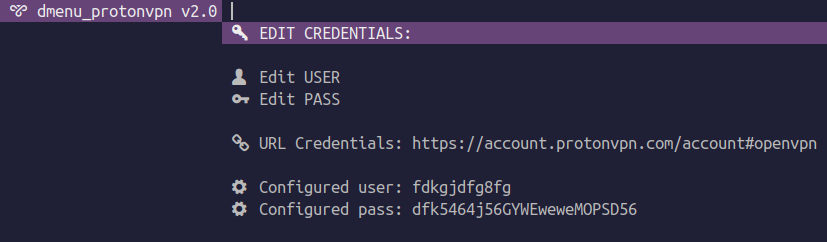
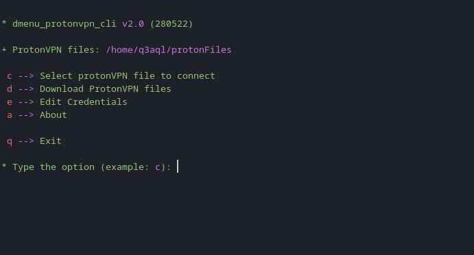

dmenu_protonvpn - Dmenu script tool for manage your ProtonVPN connections
=========================================================================

### Dependencies:
  
  * **Arch Linux:**
    * `sudo pacman -S openvpn gcc make coreutils sed expat freetype2 libxinerama xterm brotli fontconfig libbsd libmd libpng libx11 libxau libxdmcp libxft libxrender` 

  * **Debian/Ubuntu:**
    * `sudo apt install openvpn gcc make coreutils sed libexpat1-dev libfreetype-dev libxinerama-dev x11-utils xterm libxft-dev libfreetype6-dev libfontconfig1-dev libpng-dev libbrotli-dev libxrender-dev libmd-dev libxau-dev libbsd-dev libxdmcp-dev`

_Note: Installation of `kitty` is opcional._

### Build and install:

* Open terminal and run the following commands:

  ```shell
  $ git clone https://github.com/q3aql/dmenu_protonvpn
  $ cd dmenu_protonvpn
  $ sudo make install clean
  ````

### How to use:

* Open terminal and type the following command as root:

  ```shell
  dmenu_protonvpn
  ```

* You can also use the applications menu: `Menu > Network > Dmenu_ProtonVPN`

* Copy your .ovpn files to `~/protonFiles`. These files will be loaded into `dmenu_protonvpn` the next time it is run.

 
 
 
 

### How to use (CLI):

* Open terminal and type the following command as root:

  ```shell
  dmenu_protonvpn_cli
  ```
  
 
 
### External links:

  * [ProtonVPN homepage](https://protonvpn.com/)
  * [OpenVPN homepage](https://openvpn.net/)
  * [OpenVPN Community](https://openvpn.net/community-downloads/)
  * [Zenity homepage](https://wiki.gnome.org/Projects/Zenity)


